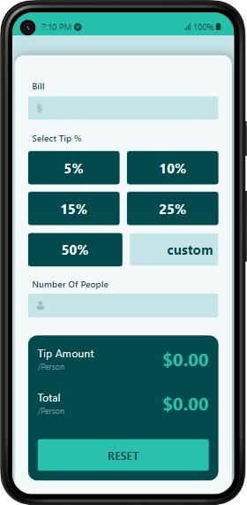
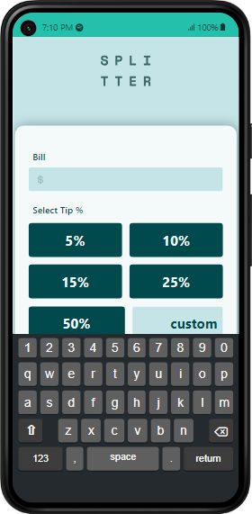
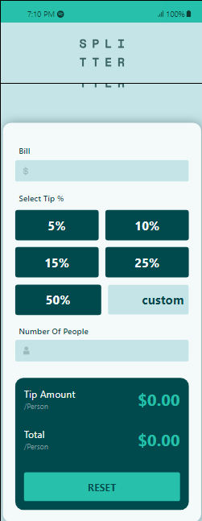
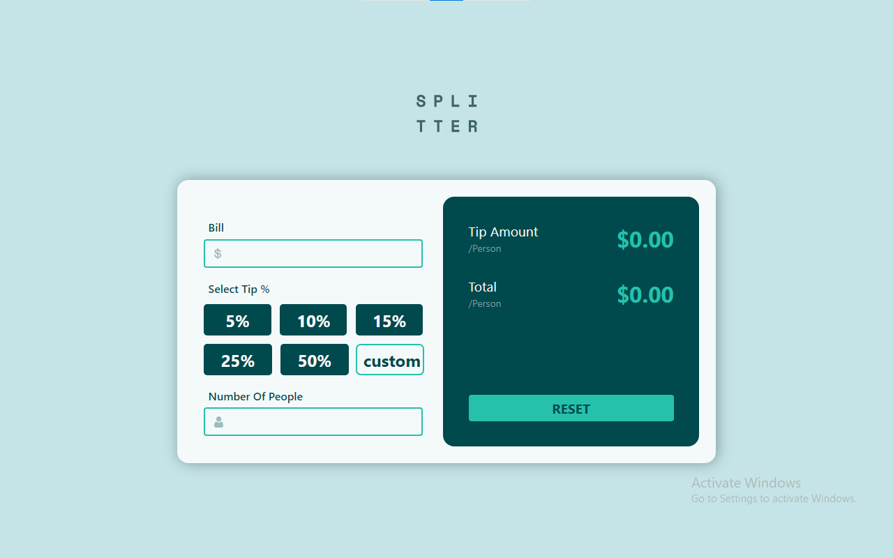

## Table of contents

- [Overview](#overview)
  - [The challenge](#the-challenge)
  - [Screenshot](#screenshot)
  - [Links](#links)
- [My process](#my-process)
  - [Built with](#built-with)
  - [What I learned](#what-i-learned)
- [Author](#author)

## Overview

### The challenge

Users should be able to:

- View the optimal layout for the app depending on their device's screen size
- See hover states for all interactive elements on the page
- Calculate the correct tip and total cost of the bill per person

### finished results Screenshot

### Links

- Solution URL: [Add solution URL here](https://your-solution-url.com)
- Live Site URL: [Add live site URL here](https://your-live-site-url.com)

## My process
- #### finihed with the marup first.
- #### the css was the most tedious work .
- #### making responsive designs needs - focus and patients. thought I could make the design responsive without any media query.
- #### the js was the most fun part of the job.

### Built with

- Semantic HTML5 markup
- CSS custom properties
- Flexbox
- Mobile-first workflow

### What I learned
there is actually nothing that is new to me aboutthis this project. It's a mini ine and it's fun...

## Author

- Website - [moha_tangx](https://www.your-site.com)
- Frontend Mentor - [@moha_ttangx](https://www.frontendmentor.io/profile/moha_tangx)
- Twitter - [@moha_tangx](https://www.twitter.com/moha_tangx)